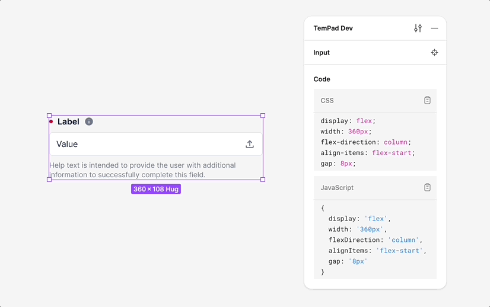

<!-- markdownlint-disable MD033 -->

# tempad-dev-plugin-kong

Kong UI plugins for [Tempad Dev](https://github.com/ecomfe/tempad-dev).

This plugin allows you to view component code and style code in both SCSS and JS formats, specifically tailored for Kong’s design system.

## Installation

1. Install [TemPad Dev](https://chromewebstore.google.com/detail/tempad-dev/lgoeakbaikpkihoiphamaeopmliaimpc) from Chrome Web Store.

2. Install `@kong` or `@kong/advanced` in TemPad Dev's plugins section.

<picture>
  <source media="(prefers-color-scheme: dark)" srcset="assets/hero-dark.gif">
  <source media="(prefers-color-scheme: light)" srcset="assets/hero-light.gif">
  
</picture>

## Features

- **CSS Codegen**: Rewrite CSS variables using design tokens from [`@kong/design-tokens`](https://github.com/kong/design-tokens).

  e.g. SCSS output:

  ```scss
  display: flex;
  width: 960px;
  padding: $kui-space-90;
  flex-direction: column;
  justify-content: center;
  align-items: center;
  gap: $kui-space-70;
  border-radius: $kui-border-radius-30;
  border: $kui-border-width-10 solid $kui-color-border;
  background: $kui-color-background;
  ```

  e.g. JS output:

  ```js
  {
    display: 'flex',
    width: '960px',
    padding: KUI_SPACE_90,
    flexDirection: 'column',
    justifyContent: 'center',
    alignItems: 'center',
    gap: KUI_SPACE_70,
    borderRadius: KUI_BORDER_RADIUS_30,
    border: `${KUI_BORDER_WIDTH_10} solid ${KUI_COLOR_BORDER}`,
    background: KUI_COLOR_BACKGROUND
  }
  ```

- **Component Codegen**: Convert design components to [Kongponents](https://github.com/kong/kongponents) code.

  e.g. `Input` to `<KInput>`:

  ```vue
  <KInput
    v-model="value"
    label="Label"
    :label-attributes="{
      info: '...',
    }"
    required
    help="Help text is intended to provide the user with additional information to successfully complete this field."
  >
    <template #before>
      <SearchIcon />
    </template>
    <template #after>
      <UploadIcon
        role="button"
        tabindex="0"
        @click="() => {}"
      />
    </template>
  </KInput>
  ```

## License

[MIT](./LICENSE) License © 2024-PRESENT [GU Yiling](https://github.com/Justineo)
